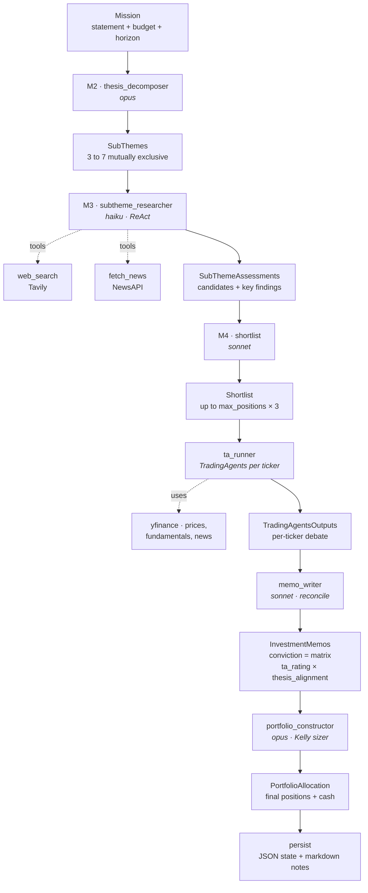

# tacapes

> Mission-driven LLM portfolio builder. Hand it a thesis and a budget; it decomposes the thesis into sub-themes, runs per-ticker [TradingAgents](https://github.com/TauricResearch/TradingAgents) debates, reconciles each one against the long-term thesis, and constructs a Kelly-sized portfolio.

<p align="left">
  
  
  
  
</p>

```
████████╗ █████╗  ██████╗ █████╗ ██████╗ ███████╗███████╗
╚══██╔══╝██╔══██╗██╔════╝██╔══██╗██╔══██╗██╔════╝██╔════╝
   ██║   ███████║██║     ███████║██████╔╝█████╗  ███████╗
   ██║   ██╔══██║██║     ██╔══██║██╔═══╝ ██╔══╝  ╚════██║
   ██║   ██║  ██║╚██████╗██║  ██║██║     ███████╗███████║
   ╚═╝   ╚═╝  ╚═╝ ╚═════╝╚═╝  ╚═╝╚═╝     ╚══════╝╚══════╝
```

---

## What it is

You hand it a free-text investment thesis and a budget. It runs a multi-stage LLM pipeline:

1. **Decomposes** the thesis into 3 to 7 mutually-exclusive, falsifiable sub-themes.
2. **Researches** each sub-theme via a ReAct loop with real web search (Tavily) and news (NewsAPI), producing 5 to 15 public-company candidates per theme.
3. **Shortlists** the union, deduplicated and ranked by conviction.
4. **Evaluates** every shortlisted ticker via [TradingAgents](https://github.com/TauricResearch/TradingAgents). That's a multi-analyst debate (market, news, sentiment, fundamentals), then bull and bear researchers, then trader, then risk debate, then PM decision.
5. **Reconciles** each TradingAgents output against the long-term sub-theme thesis to produce a structured `InvestmentMemo` with a 4-category `thesis_alignment` field and a derived conviction.
6. **Constructs** a portfolio via fractional-Kelly sizing under your mission constraints.

The whole thing is a LangGraph DAG with sequential stages (no parallel fan-out, which would otherwise saturate Anthropic input-token rate limits).

---

## Pipeline



---

## Installation

```bash
git clone https://github.com/lingz123/tacapes-v2 tacapes-v2
cd tacapes-v2
python3.12 -m venv .venv
source .venv/bin/activate
pip install -e .[dev]
```

[TradingAgents](https://github.com/TauricResearch/TradingAgents) is installed as a pip dependency directly from git, declared in `pyproject.toml`. You don't need to clone it separately.

### Configure `.env`

```bash
cp .env.example .env
```

Then fill in:

| Variable             | What it's for                                                             |
| -------------------- | ------------------------------------------------------------------------- |
| `ANTHROPIC_API_KEY`  | every LLM call (M2 through M4, memo_writer, portfolio, TradingAgents internals) |
| `TAVILY_API_KEY`     | M3 sub-theme web search. Free tier: 1k searches/mo                        |
| `NEWSAPI_KEY`        | M3 sub-theme news. Free tier: 100 req/day                                 |

---

## Quick start

### 1. Verify external dependencies

```bash
tacapes preflight
```

Hits Anthropic (5-token call), Tavily (1 search), NewsAPI (1 query), and yfinance (1 quote). Total cost well under $0.01. Exits non-zero if any check fails.

### 2. Run a mission

```bash
tacapes new \
  "Buy nuclear power names positioned to win AI/data center power contracts through 2027" \
  --budget 20000 \
  --max-positions 4 \
  --horizon 24
```

**Flags:**

| Flag              | Default | Notes                                                             |
| ----------------- | ------- | ----------------------------------------------------------------- |
| `--budget`        | 20000   | total capital in USD                                              |
| `--max-positions` | 5       | max positions in final portfolio (M4 produces `× 3` for ta_runner) |
| `--max-pos-pct`   | 0.4     | max single-position fraction (0 to 1)                             |
| `--horizon`       | 12      | time horizon in months                                            |
| `--exclude`       | (none)  | sector to exclude. Repeatable                                     |

You'll see live progress: stage panels, sub-theme tree, per-ticker spinners with elapsed time and rating, alignment-colored portfolio table, and a per-model cost breakdown.

---

## Output

Everything lands at `~/.tacapes/portfolios/<mission_id>/`:

```
mission.json              the Mission you submitted
decomposition.json        M2 output: sub-themes
shortlist.json            M4 output: deduped candidates
portfolio.json            M6 output: final positions
portfolio_state.json      M6 + timestamps

assessments/<id>.json     M3 output, one per sub-theme
ta_outputs/<TICKER>.json  raw TradingAgents debate per ticker
memos/<TICKER>.json       reconciled InvestmentMemo per ticker

notes/_SUMMARY.md         human-readable mission overview
notes/<TICKER>.md         per-ticker writeup: pre-eval → TA debate → memo

ta_logs/ ta_cache/ ta_memory/   TradingAgents internal artifacts
```

**`notes/<TICKER>.md`** is the one to read. Three sections per ticker:

1. **Why Shortlisted.** The sub-theme hypothesis, growth drivers, and research findings that surfaced this ticker.
2. **TradingAgents Evaluation.** Full multi-analyst debate: market, fundamentals, news, sentiment reports, then investment plan, trader plan, risk debate, and PM decision.
3. **Reconciled Memo.** `thesis_alignment` category, derived conviction, reconciliation notes, plus structured drivers, risks, catalysts, valuation, and thesis-breakers.

Per-ticker notes are written **incrementally** during the run (after each memo completes), so a crashed run still preserves partial output.

---

## How the reconciliation works

The memo's `conviction` is **not** an LLM-emitted number. The LLM classifies one of four `thesis_alignment` categories, and Python deterministically computes conviction from a `(ta_rating × thesis_alignment)` matrix:

| TA rating ↓ / alignment → | aligned | short_term_divergence | long_term_divergence | fully_diverged |
| ------------------------- | :-----: | :-------------------: | :------------------: | :------------: |
| Buy                       | **5**   | 3                     | 3                    | 2              |
| Overweight                | 4       | 3                     | 3                    | 2              |
| Hold                      | 3       | 3                     | 3                    | 3              |
| Underweight               | 2       | 3                     | 3                    | 2              |
| Sell                      | **1**   | 3                     | 2                    | 1              |

Read the diagonals. TA says Sell + thesis intact gives conviction 3 (Hold, not Sell). TA says Buy + thesis broken gives conviction 3 (the momentum-trap case). The reconciliation field is queryable across all memos to find portfolio-level drift.

A **three-layer fallback** ensures a single ticker's structured-output failure never kills the run:

1. Full structured `_MemoDraft` call.
2. If that fails after retries, a simpler "just pick the alignment category" call.
3. If both fail, a synthesized fallback memo with neutral alignment and the TA report verbatim.

---

## Models & costs

Models are routed by stage so input-token-per-minute caps don't bottleneck the pipeline:

| Stage                       | Model                              | Why                                                                  |
| --------------------------- | ---------------------------------- | -------------------------------------------------------------------- |
| M2 thesis_decomposer        | **opus-4-7**                       | One-shot reasoning over the mission                                  |
| M3 subtheme_researcher      | **haiku-4-5**                      | ReAct loop. Highest Tier 1 input-tokens/min cap                      |
| M4 shortlist                | **sonnet-4-6**                     | Single structured call; ranking is tractable                         |
| TradingAgents `quick_think` | **haiku-4-5**                      | Many internal analyst calls per ticker. Same rationale as M3         |
| TradingAgents `deep_think`  | **opus-4-7**                       | Bull/bear debate, trader, risk debate. Benefits from deeper reasoning |
| memo_writer                 | **sonnet-4-6**                     | One structured call per ticker. Reasoning + schema fit              |
| portfolio_constructor       | **opus-4-7**                       | One call over all memos. Benefits from deep reasoning                |

### Cost estimation

Published Anthropic prices (USD per million tokens):

| Model     | Input | Output |
| --------- | ----: | -----: |
| Opus 4.7  | 15.00 |  75.00 |
| Sonnet 4.6 |  3.00 |  15.00 |
| Haiku 4.5 |  0.80 |   4.00 |

Rough cost shape for a typical `--max-positions 4` mission (which produces ~12 shortlist candidates that ta_runner evaluates):

| Stage                                | Typical USD | Notes                                          |
| ------------------------------------ | ----------: | ---------------------------------------------- |
| M2 thesis_decomposer                 |     $0.05–0.20 | One opus call                                  |
| M3 subtheme_researcher (3-7 themes)  |     $0.50–2.00 | Haiku ReAct loops with web + news context     |
| M4 shortlist                         |     $0.10–0.40 | One sonnet call over assessments              |
| ta_runner (per ticker)               |     $2.00–8.00 | Dominant cost. Multi-agent debate per ticker  |
| memo_writer (per ticker)             |     $0.10–0.40 | Sonnet reconciliation call                    |
| portfolio_constructor                |     $0.10–0.30 | One opus call over all memos                  |
| **Total (12 tickers × ~$3 avg)**     | **~$30–60** | Bulk is ta_runner. Scales linearly in shortlist size |

The CLI prints per-model token totals and USD at the end. We attach a `langchain_core.callbacks.usage.UsageMetadataCallbackHandler` subclass to every `ChatAnthropic` instance, including those built internally by TradingAgents via its `_PASSTHROUGH_KWARGS` whitelist, so the number you see is the actual money spent.

External APIs are free for the volumes the pipeline uses (Tavily 1k/mo, NewsAPI 100/day, yfinance unkeyed).

---

## Rate limiting

Anthropic caps Tier 1 input tokens/min at 30k (sonnet), 20k (opus), 50k (haiku). Parallel fan-outs blow past this instantly with accumulating context. Our LangGraph DAG is **sequential** at every stage (no `Send` fan-outs) and `tacapes/llm.py` installs a process-wide `InMemoryRateLimiter` (0.5 rps, burst=2) shared across every `ChatAnthropic` instance. If you hit a 429 anywhere:

1. Check `console.anthropic.com → Settings → Limits`. You may have auto-tiered up.
2. If still Tier 1, lower `_RATE_LIMITER.requests_per_second` in `tacapes/llm.py`.
3. The Anthropic SDK retries on 429 with exponential backoff via `max_retries=5`.

---

## Project layout

```
tacapes/
├── cli.py                  typer entrypoint. `tacapes new` and `tacapes preflight`
├── ui.py                   shared rich Console + banner + tables + spinners
├── graph.py                LangGraph DAG. Sequential edges
├── state.py                GraphState (TypedDict)
├── config.py               TradingAgents config builder + model constants
├── llm.py                  ChatAnthropic factory + rate limiter + cost tracker wiring
├── cost.py                 CostTracker (UsageMetadataCallbackHandler) + USD pricing table
├── artifacts.py            markdown rendering for notes/<TICKER>.md and _SUMMARY.md
├── schemas/                pydantic v2, strict mode, mission-spine carries through
│   ├── mission.py
│   ├── subtheme.py
│   ├── shortlist.py
│   ├── ta_output.py
│   ├── memo.py             InvestmentMemo + ThesisAlignment Literal
│   ├── portfolio.py        PortfolioAllocation + sum-to-1.0 validator
│   └── common.py           Source, Driver, Risk, Catalyst, Valuation, WebResult, NewsItem
├── tools/                  langchain @tool callables for the M3 ReAct agent
│   ├── web_search.py       Tavily wrapper
│   └── news.py             NewsAPI wrapper
├── prompts/                .md prompts loaded by name
├── nodes/                  one file per LangGraph node + matching mock_*
└── tests/                  pytest, mocked LLMs
```

---

## Development

```bash
# tests
pytest -q

# preflight (cheap smoke test against live APIs)
tacapes preflight

# format / lint (ruff is in dev extras)
ruff check tacapes/
```

---

## Limitations & honest caveats

- **TradingAgents is short-term oriented.** Its analysts explicitly look at "the past week" of news, sentiment, and fundamentals (the `freq="quarterly"` calls grab the latest 10-Q, but the prompts frame everything through a 1-week lens). We compensate via the memo_writer reconciliation step, which downweights short-term-only signals against the long-term thesis. Read `notes/<TICKER>.md`'s Reconciliation section to see this in action.
- **No git checkpointing for partial runs yet.** If a run crashes after ta_runner but before persist, you keep `notes/<TICKER>.md` for completed tickers (written incrementally by memo_writer) but no top-level JSON. Re-run from scratch.
- **No portfolio rebalancing.** v1 scope is cold-start only. The `ConstructorMode` enum exists for v2 incremental.
- **Data quality.** TradingAgents uses yfinance (free, unkeyed) for everything: prices, fundamentals, news. It's fine for narrative analysis on a 12+ month horizon but won't catch sub-day signals.
- **Cost isn't capped.** A wide thesis can produce 15+ candidates × $2–8/ticker. Use a narrow mission statement for smoke tests.

---

## Not financial advice

This is a research tool. It produces structured arguments for a portfolio. It does not place trades, account for taxes, or know your real risk tolerance. Read the memos, sanity-check the reasoning, and decide for yourself.

---

## License

TBD.
